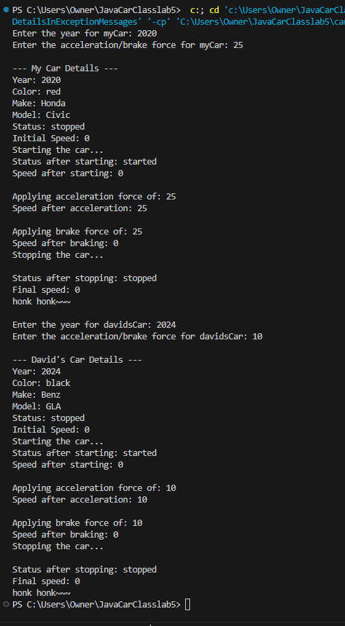
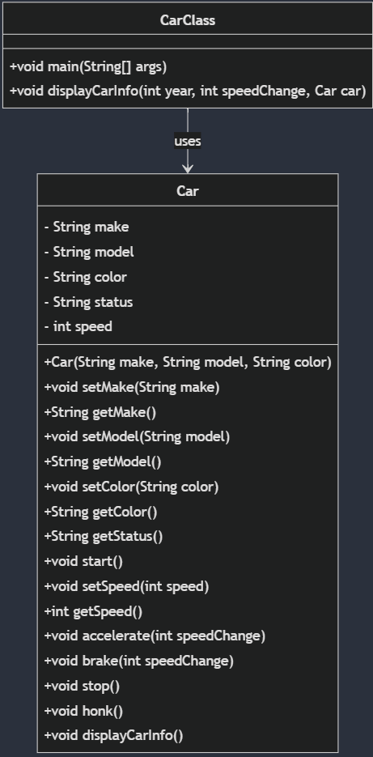

# Project Overview
This project contains a simple `Car` class with methods to accelerate, brake, and manage the car's state.

## Output Screen

## Class Diagram

## Files

### [Car.java](src/main/java/com/me/carclass/Car.java)
**Synopsis**:
The `Car` class represents a car with attributes such as make, model, color, status, and speed. It provides methods to start, stop, accelerate, brake, and honk the car. The class encapsulates the car's state and behavior, allowing controlled access through getter and setter methods.

### [CarClass.java](src/main/java/com/me/carclass/CarClass.java)
**Synopsis**:
The `CarClass` contains the `main` method, which serves as the entry point for the application. It demonstrates the usage of the `Car` class by creating instances of `Car`, setting their attributes, and calling their methods to simulate car operations.

## Interaction Between Car.java and CarClass.java

- **Instantiation**: `CarClass.java` creates instances of the `Car` class.
- **Setting Attributes**: `CarClass.java` sets the attributes of the `Car` instances using setter methods.
- **Calling Methods**: `CarClass.java` calls methods on the `Car` instances to start, stop, accelerate, brake, and honk the car.
- **Displaying State**: `CarClass.java` retrieves and displays the state of the `Car` instances using getter methods.

## Author: [Harry Joseph](https://github.com/hjoseph777)
## Date: 2024-10-26
